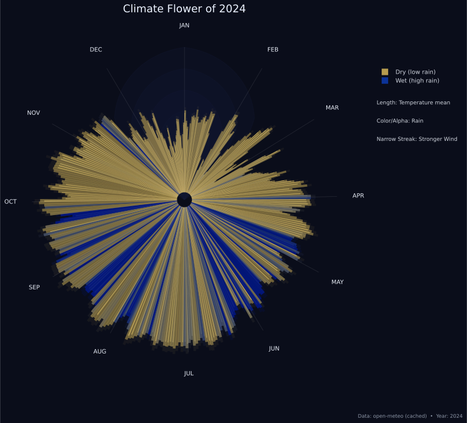

# Climate Flower of 2024

A radial "Climate Flower" visualization: each day of the year is a petal (365 petals). Petal length encodes mean temperature, color & transparency encode rainfall (dry amber → wet deep blue), and subtle narrow inner streaks mark higher wind days.

<!-- Static raster preview -->


<!-- Vector preview (SVG) -->
<p align="center">
	
</p>

## Quick Start
```bash
# 1. (Optional) create venv
python -m venv .venv
./.venv/Scripts/Activate.ps1   # Windows PowerShell

# 2. Install dependencies
pip install -r requirements.txt

# 3. Run
python climateFlower.py
```
The script fetches (or synthesizes) daily data for 2024, caches under `.cache/`, and opens an interactive window.

Hover behaviour now uses a lightweight custom `motion_notify_event` handler (no `mplcursors` dependency): move over a petal to see a transient tooltip (date / temp / rain / max wind); move away and it disappears immediately.

## Features (Summary)
- 365 radial bars (Jan 1 at top, clockwise) with glassy layered glow.
- Length = mean temperature (normalized).
- Color + alpha = rainfall (robust p90 scaling).
- Subtle wind streak bars (filtered by adaptive threshold).
- Month labels (JAN–DEC) and faint month-start guide lines.
- Hover tooltip (date, temperature, rain, max wind) + light highlight (custom event-based, not mplcursors).
- Caching of API responses to speed reruns; synthetic fallback if API fails.

## Export
PNG (and optional SVG when `save_svg=True`).

## Minimal API
```python
from climateFlower import plot_glass_flower
plot_glass_flower(2024, save_path='glass_flower_2024.png', save_svg=True)
```

## Data Source
Open-Meteo API (archival endpoint). If unreachable, a seasonal synthetic dataset is generated with similar annual patterns.

## License
(Choose a license: e.g. MIT. Add a LICENSE file if needed.)

---
For a full deep-dive (color math, wind normalization, customization, troubleshooting), see `README_FULL.md`.
